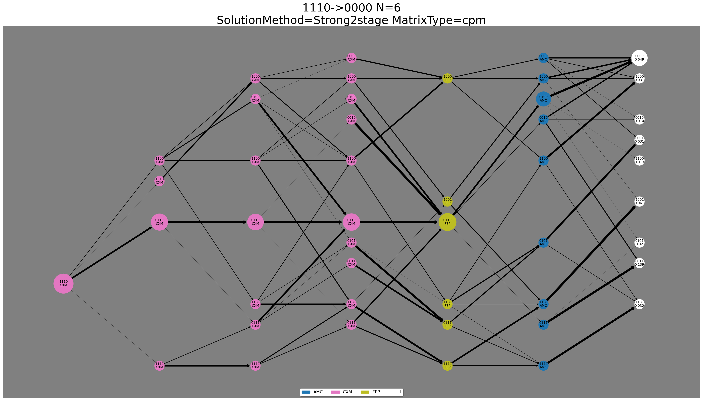

# A Stochastic Programming Approach to the Antibiotics Time Machine Problem

This repository contains the code for the paper A Stochastic Programming Approach to the Antibiotics Time Machine Problem

## Authors
- Oğuz Mesüm ([@oguzmes](https://github.com/oguzmes))
- Assoc. Prof. Burak Kocuk ([@burakkocuk](https://github.com/burakkocuk))
- Prof. Ali Rana Atılgan

## Usage 
### Setup
1. Install dependencies:
 - python 3.7
 - numpy 1.19.5
 - pandas 1.3.4
 - networkx 2.5
 - gurobipy 10.0.0

2. Data
The data used in this research can be found under repository named `msx255_SuppData2017_GRME_ABR.xlsx`.

Requirements can also be found in `requirements.txt`.

### Clone the repository:
	git clone https://github.com/oguzmes/StochasticAntibiotic.git

### Running Code and Getting Results
Tool can be used from CLI after installing the necessary dependencies and cloning the repository. The information on how to use the tool is also defined within itself.

	python ABR.py -h
 
	usage: StochasticAntibiotic [-h] [--dataset DATASET] [--n [N]] [--initialState [INITIALSTATE]]
				    [--targetState [TARGETSTATE]] [--plotSolution]
				    [--solutionMethod {DP,Multistage,Strong2stage,Weak2stage}]
				    [--matrixSamplingSize MATRIXSAMPLINGSIZE] [--matrixType {epm,cpm}] [--timeLimit TIMELIMIT]
	
	Tool used to evaluate multiplication of matrices daha fazlasi, yazilabilir
	
	optional arguments:
	  -h, --help            show this help message and exit
	  --dataset DATASET
	  --n [N]               step size (default: 3)
	  --initialState [INITIALSTATE]
				initial state selection (default: 1011)
	  --targetState [TARGETSTATE]
				target state selection (default: 0000)
	  --solutionMethod {DP,Multistage,Strong2stage,Weak2stage}
				solution method selection (default: DP)
	  --matrixSamplingSize MATRIXSAMPLINGSIZE
				matrix sampling size selection (default: 10000)
	  --matrixType {epm,cpm}
				matrix type selection (default: cpm)
	  --timeLimit TIMELIMIT
				time limit (seconds) for solvers (default: 3600)
	
	Developed by O. Mesum, Assoc. Prof. B. Kocuk

The following code will find best antibiotic treatment plan starting from genotype *1110* to genotype *0001* in *6* steps using *Strong2stage* method. Solver is time limit is set to *1000* seconds and matrix sampling size is *1000* for both evaluator and optimizer. If successful within time limit it will plot the solution aswell.

```bash
python ABR.py --dataset msx255_SuppData2017_GRME_ABR.xlsx --initialState 1110 --n 6 --targetState 0000 --solutionMethod Strong2stage
     
Matrix_useCase=optimization_type=cpm_s=10000 does not exist, generating from scratch.
Matrix_useCase=evaluator_type=cpm_s=10000 does not exist, generating from scratch.
Saved N6_1110-0000_Strong2stage_cpm_solution.xlsx under ..\Data\Solutions.
Saved N6_1110-0000_Strong2stage_cpm_plot.png under ..\Data\Solutions.
```
Results of each runs can be found under  `..\Data\Solutions`.


- Prior to solving instances the matrix sampling part might take long. So to avoid this for further replicatons and experimentation sampled matrices are saved under `..\Data\MatrixFiles`. 


<table>
<tr>
<td>


</td>
<td>

|                    | Info         |
|:-------------------|:-------------|
| OptVal             | 0,649        |
| EvaVal             | 0,65         |
| SolutionMethod     | Strong2stage |
| bbNode             | 409          |
| elapsedTime        | 1,311        |
| matrixSamplingSize | 10000        |
</td>
</tr>
</table>

On left hand side we can see optimal antibiotic treatment plan. On right hand side there are descriptive statistics on problem instance and solver.
- `OptVal`: Optimal objective value of the problem.
- `EvaVal`: Evaluator objective value given optimal treatment plan.
- `SolutionMethod`: Selected solution method for problem instance.
- `bbNode`: Number of branch and bound node used in optimizer.
- `elapsedTime`: Elapsed time for given problem instance.
- `matrixSamplingSize`: Matrix sampling size defined in the experimentation.

.xlsx file under `..\Data\Solutions` contains much more detailed statistics on problem instance. Under U_values sheet, you can find state probabilities at each timestep, and under solution you can find used antibiotics in solution.  

Also notice node sizes and arc widths are different from each other. This is due to node and edges representing transition and state probabilities at each timestep.


```bash
python ABR.py --dataset msx255_SuppData2017_GRME_ABR.xlsx --initialState 1111 --n 5 --targetState 0000 --solutionMethod DP
     
Returning Matrix_useCase=optimization_type=cpm_s=10000 from existing file.
Returning Matrix_useCase=evaluator_type=cpm_s=10000 from existing file.
Saved N5_1111-0000_DP_cpm_solution.xlsx under ..\Data\Solutions.
Saved N5_1110-0000_DP_cpm_plot.png under ..\Data\Solutions.
```

<table>
<tr>
<td>


</td>
<td>

|                    | Info   |
|:-------------------|:-------|
| OptVal             | 0,753  |
| EvaVal             | 0,754  |
| SolutionMethod     | DP     |
| bbNode             | 0      |
| elapsedTime        | 0      |
| matrixSamplingSize | 10000  |
</td>
</tr>
</table>


## Known Issues 
- The code has not been tested on Python versions other than 3.7.
- The code may not work with versions of dependencies other than those specified above.
- There aren't input checks for most of the cases.
- Strong2Stage, Multistage, Weak2stage requires Gurobi License.


  
## License 
The code in  this repository is released under the [MIT License](LICENSE).


## Citing
If you use this code or the results from our paper in your own work, please cite our paper:`
```sql
 @article{stoch-antibiotic,
  title={Stochastic Antibiotic},
  author={},
  journal={},
  volume={},
  pages={},
  year={2023}
}
```
